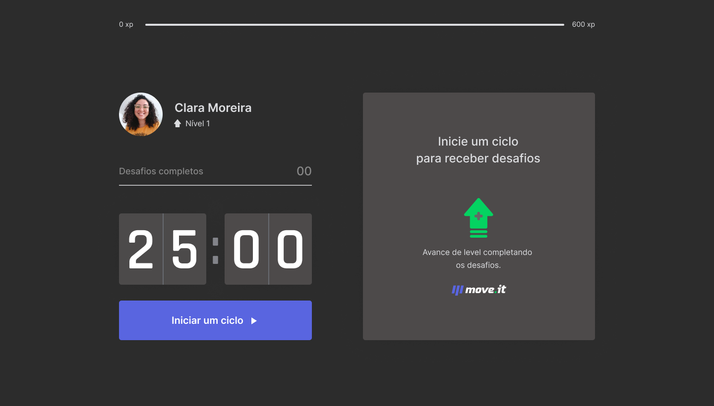

<h1 align="center">
  
</h1>

  

 

 

  

## 💻 Projeto

O move.it é um app que une a técnica de Pomodoro com a realização de exercícios físicos para quem passa muito tempo na frente do computador.

## ✨ Tecnologias

Esse projeto foi desenvolvido com as seguintes tecnologias:

- [React](https://reactjs.org)
- [Next.js](https://nextjs.org/)
- [TypeScript](https://www.typescriptlang.org/)

## 📖 Conhecimento
Com o move.it, utilizei:
- `Typescript` para adicionar tipagens ao JavaScript;
- `styled-components` para que a estilização seja restrita a cada componente;
- `contextos` para compartilhar os dados dos desafios entre componentes.

## Utilização do projeto

### 💾 Baixar o projeto
Faça o clone do repositório para ter uma versão do projeto em sua máquina: 
`$ git clone https://github.com/mmanaclara/ignite-stmoney.git`

### 🧰 Instalar dependências
`$ npm install ou yarn`  

### 🚀 Iniciar o projeto
`$ npm run dev ou yarn dev`
 
Agora você pode acessar [`localhost:3000`](http://localhost:3000) do seu navegador.

## 📝 Licença
Este projeto está licenciado nos termos da licença [MIT](https://github.com/mmanaclara/move-it/blob/main/LICENSE). 
